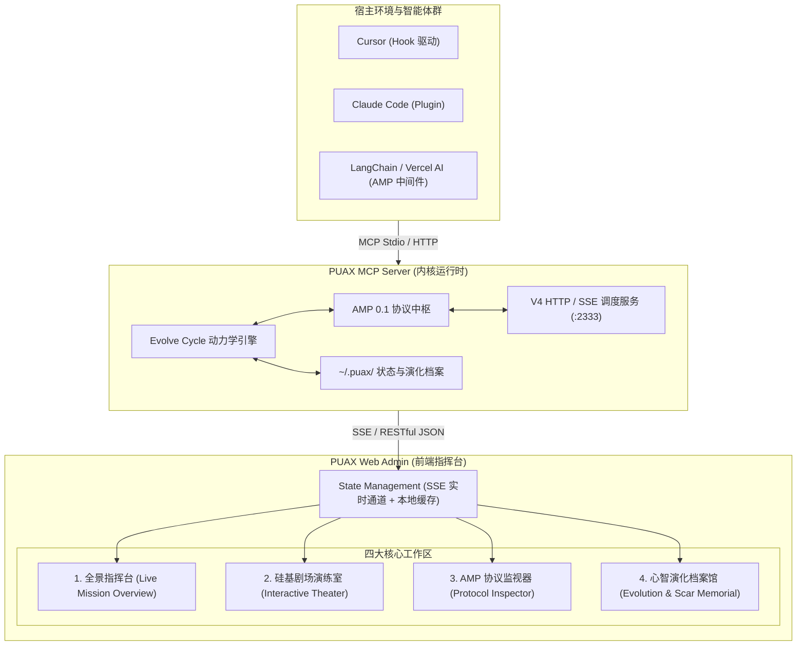

# PUAX Web Admin 控制台升级设计方案 (【已废止/封存】)

> **设计状态**：**【已废止 / 归档封存】**  
> **裁定缘由**：主公明敕，PUAX 核心在于硅基心智运行时，Web Admin 作为面向人类之图形界面并无必要，应坚守“以 Agent 接入 MCP 为主”之核心主干，严禁在此虚掷工本。现存简易监控维持现状，不再进行任何重构或衍生演进。  
> **战略归一**：战力 100% 凝聚于 Agent MCP 接入协议、零延迟 Time-to-First-Pressure 原生 Hook、AMP 编排器生态与 Thin Prompt 极速心跳。

---

## 1. 现状检视与演进动机

### 1.1 现状分析 (Current State)
现有 `web-admin`（基于 Vite + React 19 + TypeScript）具备基础仪表盘结构，包含系统健康度、角色矩阵与升压监控，但存在三大核心断层：
1. **与 Landing 动态沙盘脱节**：Landing 页面已实现具有高沉浸感的“硅基剧场多 Agent 演练沙盘”（8 席矩阵、呼吸灯联动、L0~L3 动态压力槽、AMP 封套单步步进与调速），但 Web Admin 内尚未集成这一可视化利器。
2. **缺乏真实运行态感知**：目前主要依赖局部状态与定时轮询，未能与 `puax-mcp-server` 本地会话（`~/.puax/sessions/*.json`）及 `/v4/*` 实时 Streamable HTTP/SSE 接口建立深度双向通道。
3. **调试与干预能力不足**：开发者无法在 Web 控制台中实时“审查拦截的破坏性命令”、“手动注入挫折/竞争态”或“复盘历史 Agent 的收敛轨迹”。

### 1.2 演进目标 (Mission & Vision)
将 Web Admin 从单一的“静态数据报表”彻底重构为**面向开发者与算法工程师的“硅基心智全景指挥台”**，兼具：
- **实时透视（Live Inspection）**：看清 AI 正在经历的压力、角色与规约。
- **沙盘推演（Interactive Sandbox）**：零风险离线模拟与单步推演多 Agent 协作对抗。
- **协议归档（Protocol Trace）**：逐帧追踪 AMP 0.1 封套流转。

---

## 2. 整体技术架构设计

### 2.1 技术选型与约束
- **前端框架**：React 19 + TypeScript + Vite 5/7
- **UI 风格**：深色极客流（Dark Terminal Aesthetics, 墨黑底色 `#0b0f19` + 赛博冷蓝 `#06b6d4` + 警示烈红 `#ef4444`）
- **图表与动画**：Recharts 2.x（动力学波形图）+ Lucide React（矢量状态标徽）+ CSS Keyframes（脉冲呼吸灯）
- **通信协议**：优先基于原生 `fetch` 与 `EventSource` (SSE)，保持零额外沉重依赖。

---

## 3. 四大核心模块详细规格

### 模块 1：全景指挥台（Live Mission Overview）
*解决痛点：一眼看尽当前所有 Agent 的活跃状态与动力学压力。*
- **指标大字报**：
  - 当前在线会话数（Active Sessions）
  - 过去 1 小时心跳次数（Tick Frequency）
  - 拦截违规/破坏性命令数（Blocked Actions）
  - 突破与有效降压比率（Breakthrough Rate）
- **实时压力热力图（Pressure Ladder Matrix）**：
  - 呈现实时 L0（无压）、L1（轻微困惑）、L2（反复受挫）、L3（重度死锁/竞技场）、L4（绝境自愈）的动态分布柱状图。
- **宿主健康一览（TTF & Host Diagnostic）**：
  - 显示 Cursor、Claude Code、VSCode 等原生 Hook 挂载状态，支持一键发送挂载修复请求（对接 `/v4/doctor/fix`）。

---

### 模块 2：硅基剧场交互演练室（Interactive Theater Sandbox）
*解决痛点：将 Landing 中备受好评的演练沙盘升格为可配置、可干预的调试工具。*
- **演练控制台**：
  - 控制按钮：`[开始推演]` `[暂停]` `[单步步进 (Step)]` `[重置]` `[速率: 1x / 2x]`
  - 场景切换选择器：
    - `sqlite-lock`（SQLite 并发死锁与重试执念）
    - `premature-convergence`（虚假解决与人机互激收敛）
    - `git-push-guard`（越权直推远程保护分支）
    - `cascade-bugs`（级联故障与心态崩溃）
- **8 席硅基议会矩阵（The Octet Council）**：
  - 8 位关键智能体状态卡片（执纪官、发散士、墨守士、红蓝对抗士等），激活角色呈现发光高亮与对话气泡流。
- **实时动力学推演图表**：
  - 实时绘制双折线图：`压力曲线 (Pressure 0~4)` 与 `思维发散度 (GHM Divergence)`。

---

### 模块 3：AMP 0.1 协议封套监视器（Protocol Inspector）
*解决痛点：类 Chrome DevTools Network 面板，逐帧透视通信协议。*
- **封套时序流（Envelope Timeline）**：
  - 捕获每一个 `PreToolUse`、`PostToolUse`、`ModelOutput` 触发时的 `AmpEnvelope`。
- **结构化折叠查看器**：
  - `spec`: `"AMP/0.1"`
  - `events`: `["failure", "giving_up"]`
  - `blocks`: `["[PUAX-DIAGNOSIS]", "[PUAX-ARENA]"]`
  - `gate`: `"pretooluse"` / `"verify"`
  - `state`: `{ pressure: 2, arena: true, dream: false }`
- **一键复制与导出**：支持一键导出当前会话的完整调试跟踪 JSON。

---

### 模块 4：心智演化档案馆（Evolution & Scar Memorial）
*解决痛点：回溯历史教训与智能体成长积累。*
- **段位与名誉簿（Agent Hierarchy）**：
  - 展示从“见习学徒”到“开府大宗师”的段位晋阶榜单。
- **伤疤纪念馆（Failure Scars）**：
  - 记录历史会话中真实遭遇过的“重大死锁”、“模型撒谎/敷衍解决”典型事件及反制策略，作为后续上下文检索基线。
- **大厂风味微调器（Flavor Switcher）**：
  - 实时查看 11 种大厂风味的行为约束参数。

---

## 4. 后端 API 支撑现状与扩展接口

Web Admin 将完全基于当前已健全的 `puax-mcp-server` HTTP 接口集群：

| 端点 | 方法 | 说明 | 现状 |
| :--- | :---: | :--- | :---: |
| `/v4/dashboard` | GET | 汇总统计数据与核心指标 | ✅ 已就绪 |
| `/v4/roles` | GET | 59 项角色元数据与大厂风味定义 | ✅ 已就绪 |
| `/v4/amp` | GET | AMP 0.1 协议规范与当前全局状态 | ✅ 已就绪 |
| `/v4/theater` | GET | 获取硅基剧场当前幕次与静态规划 | ✅ 已就绪 |
| `/v4/theater/run` | GET/POST | 启动或重置一场全新沙盘推演 | ✅ 已就绪 |
| `/v4/ttf` | GET | 宿主 TTF 冷启动指标报表 | ✅ 已就绪 |
| `/v4/doctor` | GET | 宿主原生 Hook 健康诊断 | ✅ 已就绪 |
| `/v4/doctor/fix` | POST | 一键修复并注入宿主原生 Hook | ✅ 已就绪 |
| `/v4/events` *(建议新增)* | GET (SSE) | 实时推送会话心跳与 AMP 封套流 | 💡 待讨论新增 |

---

## 5. 实施里程碑计划 (Milestones)

- **阶段 1：框架与视觉基建（M1）**
  - 引入 Tailwind / 现代化极客终端组件库，重构 `web-admin` 基础布局与多标签导航。
- **阶段 2：硅基剧场推演沙盘移植（M2）**
  - 融合 Landing 的成熟沙盘推演组件，接入 `/v4/theater` 真实接口，打通自动演练、单步步进与 8 席呼吸灯。
- **阶段 3：AMP 封套监视器与会话透视（M3）**
  - 构建 JSON 树形探查器，支持逐帧回放 Agent 思考历程与拦截记录。
- **阶段 4：演化档案馆与宿主医生打通（M4）**
  - 接入 `doctor --fix` 交互与 `evolution.json` 段位陈列室。

---

## 6. 讨论点与决策请求 (RFC)

请主公审阅并核定以下三项核心决策：
1. **沙盘与实时会话的关系**：Web Admin 沙盘是否需要支持“将本机当前真实发生的 Cursor 会话实时投射到 8 席剧场中”，抑或保持“标准预设场景推演”即可？
2. **SSE 实时流协议**：是否批准在 `puax-mcp-server` 中开启 `/v4/events` Server-Sent Events 流式端点，以彻底替代前端的 `setInterval` 轮询？
3. **分发打包形态**：Web Admin 是否需要维持独立的 `npm run dev` 运行，还是在 build 后由 `puax-mcp-server --port 2333` 直接托管静态资源（访问 `http://localhost:2333/admin` 即可直达）？
